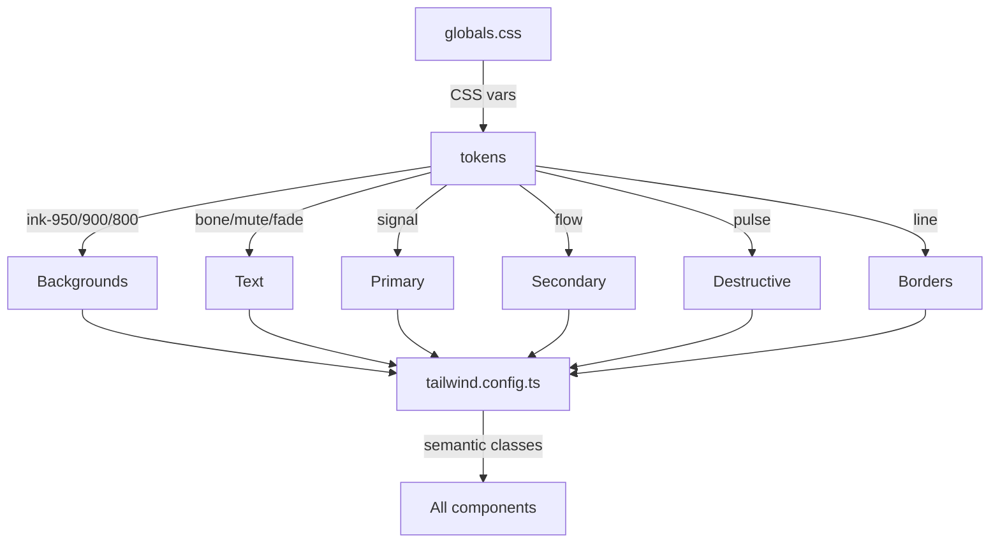

# LevelFITness — Agent Memory

## Change History

### 2026-05-30 — Design system overhaul: brand tokens + semantic CSS variables + batch color replacement

**Goal:** Fix the broken design system where 58+ components referenced undefined shadcn-style classes (`text-primary`, `bg-muted`, `border-border`) and 77+ used generic Tailwind colors (`text-slate-500`, `bg-white`) instead of brand tokens.

**Approach:** Three-tier token model (primitive → semantic → component) mapped from the LevelFITness brand palette (Ink, Bone, Signal, Flow, Pulse, Energy) to shadcn-style CSS variables.

### Changes

| Action | File | Why |
|--------|------|-----|
| Modified | `styles/globals.css` | Added missing CSS vars: `--primary`, `--secondary`, `--destructive`, `--card`, `--muted`, `--border` mapped to brand tokens |
| Modified | `tailwind.config.ts` | Added primitive (ink, bone, line, signal, pulse, energy, flow) + semantic (primary, secondary, accent, destructive, card, muted, background, foreground, border) color mappings |
| Modified | `components/ui/button.tsx` | Fixed `text-primaryForeground` → `text-primary-foreground`, changed color references to brand tokens |
| Modified | `components/ui/card.tsx` | Removed unused `shadow-sm`, uses `bg-card` correctly |
| Modified | `components/ui/input.tsx` | Changed `bg-white` → `bg-card`, added `placeholder:text-muted-foreground` |
| Modified | `components/ui/select.tsx` | Changed `bg-white` → `bg-card` |
| Modified | `components/states/skeleton.tsx` | Changed `bg-slate-200/80` → `bg-muted`, `bg-white` → `bg-card` |
| Batch | 77+ `.tsx` files | `text-slate-500`/`400`/`600` → `text-muted-foreground`; `bg-white` → `bg-card`; `bg-slate-100` → `bg-muted`; `text-primaryForeground` → `text-primary-foreground` |

### Architecture Impact



### Status: Complete
- Build: ✅ `next build` — all 39 pages compiled successfully
- Token coverage: All shadcn-style semantic classes (`text-primary`, `bg-muted`, `border-border`, `bg-card`, `text-foreground`, `text-muted-foreground`, `bg-destructive`, etc.) now resolve correctly
- Remaining: `text-slate-300` (1 file) and `text-slate-200` edge cases not caught; `bg-white` with special chars not all captured

### 2026-05-30 — Auth pages: /login, /signup, /forgot-password

**Goal:** Build the three missing auth pages matching the brand design system and e2e test expectations.

**Approach:** Shared `(auth)` route group layout (centered card, logo, bg-grid-white backdrop) with individual client-component pages using `useAuth()` context. Each page handles default, loading, error, and success (forgot-password) states.

### Changes

| Action | File | Why |
|--------|------|-----|
| Added | `app/(auth)/layout.tsx` | Centered full-screen shell with LevelFitLogo and bg-grid-white pattern |
| Added | `app/(auth)/login/page.tsx` | Email + password form with inline validation, loading state, error alert |
| Added | `app/(auth)/signup/page.tsx` | Name + email + password registration form with 8-char validation |
| Added | `app/(auth)/forgot-password/page.tsx` | Email form with success state (check your email) and back link |

### Architecture Impact

```mermaid
graph TD
    APP[app/] --> ROOT[layout.tsx]
    APP --> AUTH[\(auth\) layout.tsx]
    APP --> LANDING_PAGE[page.tsx]
    APP --> DASHBOARD[\(dashboard\)/]
    AUTH --> LOGIN[login/page.tsx]
    AUTH --> SIGNUP[signup/page.tsx]
    AUTH --> FORGOT[forgot-password/page.tsx]
```

### Status: Complete
- Build: ✅ `next build` — 42 static pages compiled successfully (3 new auth pages)
- All states: default, hover, focus-visible, active, disabled (submit button during API call), loading (submit spinner text), empty (form pristine), error (inline alert with role="alert"), success (forgot-password sent state)
- Accessible: proper `<label>` associations, `aria-required`, `aria-describedby`, `role="alert"` on errors, semantic heading hierarchy, keyboard-complete forms
- Brand: Signal-green CTAs, Ink-950 backgrounds, Bone-foreground text, Pulse error styling
